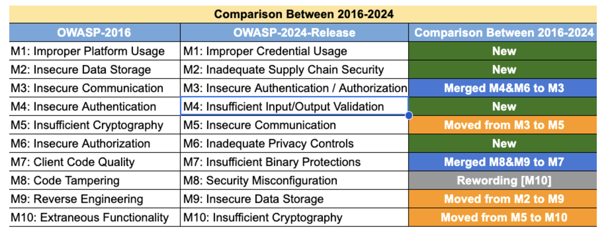

Mobile app security is a critical concern for developers and users alike. The [Open Web Application Security Project (OWASP)](https://owasp.org/) Mobile Security Project provides a comprehensive guide to the top 10 security risks for mobile apps. This article will cover the top 10 security threats and how to protect your app using OWASP Mobile's best practices.
But first let's take a look at the common mobile app security threats.

## Common Mobile App Security Threats

- **Malware**: Malicious software intentionally designed to harm, exploit, or compromise a mobile device, its data, or the user. Mobile app malware can take various forms, often disguised as legitimate apps or embedded within apps to deceive users into installing it on their devices.

  - Trojan
  - Spyware
  - Adware
  - Ransomware
  - Banking Malware
  - Keylogger
  - Rooting/Jailbreaking Tools
  - Worms
  - Backdoor

  and more.

- **Phishing**: In a mobile app, it is a deceptive attempt by malicious actors to trick users into revealing sensitive information, such as login credentials, financial details, or personal data, through fraudulent means. Phishing typically relies on social engineering techniques to exploit user trust and manipulate users into taking actions that compromise their security.
- **Man in the middle attacks (MitM)**: Interception of communication between mobile apps and APIs, allowing attackers to eavesdrop or modify data
- **Data breaches:** Unauthorized access leads to the exposure of sensitive user data. Risks include personal information (PII), credentials, and financial data.
- **Authentication attacks**: in a mobile app are attempts by malicious actors to exploit vulnerabilities in the app's authentication mechanisms to gain unauthorized access to user accounts, sensitive data, or application functionality. These attacks target flaws in how the app verifies the identity of its users or systems.
  - Credential Stuffing
  - Brute Force Attacks
  - Phishing Attacks
  - Session Hijacking
  - Man-in-the-Middle (MitM) Attacks
  - Password Reset Exploits
  - _OAuth and Token-Based Attacks_: Attackers exploit vulnerabilities in OAuth flows or misconfigure token handling to gain unauthorized access.
- **Code tampering**: Unauthorized modification of the mobile app's code, potentially leading to functionality alterations or the injection of malicious code.
- **Reverse engineering**: Extraction of source code or sensitive information from the mobile app, often to create fake versions.
- **API Security risks**: Inadequate protection of APIs, leading to vulnerabilities such as unauthorized access, injection attacks, and data exposure.
- **Insecure data storage**: Weak encryption or improper storage of sensitive data on the device, making it vulnerable to unauthorized access.
- **Insufficient Transport Layer Protection:** Lack of proper TLS encryption during data transmission, exposing information to interception and manipulation.
- **Denial of Service (DoS) Attacks:** Overwhelming a mobile app or API with traffic disrupts its availability, causing service downtime.
- **Unsecured Third-Party Libraries:** Integration of insecure or outdated third-party libraries, introducing potential vulnerabilities into the mobile app.
- **Poorly Implemented Multi-Factor Authentication (MFA):** Inadequate implementation of MFA, allowing attackers to bypass additional authentication measures.
- **Supply Chain Attacks:** Compromising the security of a mobile app or API through vulnerabilities in its supply chain, including third-party services or components.

And more.

## OWASP (Open Worldwide Application Security Project)

The **Open Worldwide Application Security Project (OWASP)** is a globally recognized nonprofit organization dedicated to improving the security of software and web applications. Established in 2001, OWASP provides resources, tools, and best practices to help developers, organizations, and security professionals build secure applications and address vulnerabilities effectively.

### Importance of OWASP

- **Promotes Secure Development**: Encourages developers to integrate security practices from the ground up.
- **Universal Accessibility**: Resources are open-source and widely adopted across industries.
- **Standardization**: Sets benchmarks for assessing and improving application security.
- **Collaboration**: Facilitates knowledge sharing among global security professionals.

### OWASP Mobile Top 10 Security Risks in 2024

The OWASP Mobile Top 10 is a list of the most critical security risks for mobile apps, updated periodically to reflect emerging threats and trends. The latest version, OWASP Mobile Top 10 2024, highlights the following risks:

_Source_: [OWASP Mobile Top 10 2024](https://owasp.org/www-project-mobile-top-10/)

- **M1: Improper Credential Usage**: Threat agents can exploit hardcoded credentials or improper credential usage in mobile applications by using automated tools, either publicly available or custom-built. These vulnerabilities make it easier for attackers to locate and exploit the credentials or weaknesses in their implementation.

  - **How to prevent it?**:
    - Avoid hardcoding credentials in the app's code or configuration files.
    - Implement secure credential storage mechanisms, such as the Android Keystore or iOS Keychain or use revocable tokens.
    - Use strong encryption and hashing algorithms during credential storage and transmission.
    - Avoid weak authentication mechanisms, such as weak passwords or insecure authentication flows.

More information on _M1: Improper Credential Usage_ [here.](https://owasp.org/www-project-mobile-top-10/2023-risks/m1-improper-credential-usage.html)

- **M2: Inadequate Supply Chain Security**: Attackers can exploit vulnerabilities in the mobile app supply chain, such as inserting malicious code during development or exploiting flaws in third-party libraries, SDKs, or hardcoded credentials. These actions can lead to data theft, user surveillance, unauthorized access to backend servers, denial of service, or full control over the app or device.

  - **How to prevent it?**:
    - Apply secure coding, code review, and testing throughout development.
    - Ensure secure app signing and distribution to block malicious actors.
    - Use trusted, validated third-party libraries to minimize risks.
    - Implement security controls for updates and patches to address
      vulnerabilities.
    - Monitor and detect supply chain incidents with testing and scanning for timely responses.

More information on _M2: Inadequate Supply Chain Security_ [here.](https://owasp.org/www-project-mobile-top-10/2023-risks/m2-inadequate-supply-chain-security.html)

- **M3: Insecure Authentication/Authorization**: Threat agents that exploit authentication and authorization vulnerabilities typically do so through automated attacks that use available or custom-built tools.

  - **How to prevent it?**:
    These are only a few of the many ways to prevent this threat:
    - Use server-side authentication; avoid client-side methods to prevent bypasses.
    - Encrypt local data if needed, but mitigate risks of binary attacks.
    - Implement device-specific tokens instead of storing passwords or using weak identifiers.
    - Make persistent authentication opt-in, and avoid weak PINs for passwords.
    - Enforce all controls server-side; assume client-side can be bypassed.
    - Use biometrics (FaceID, TouchID) for secure access to sensitive data.
    - Perform local integrity checks if offline functionality is necessary.

More information on _M3: Insecure Authentication/Authorization_ [here.](https://owasp.org/www-project-mobile-top-10/2023-risks/m3-insecure-authentication-authorization.html)

- **M4: Insufficient Input/Output Validation**: insufficient validation and sanitization of user inputs or network data in mobile apps can lead to critical vulnerabilities, including SQL injection, command injection, and XSS attacks. These flaws may enable unauthorized data access, app manipulation, system compromise, data corruption, or malicious code injection, posing significant security risks.

  - **How to prevent it?**:
    - **Input Validation**: Use strict validation, set length limits, and reject unexpected or malicious input.
    - **Output Sanitization**: Sanitize output to prevent XSS (cross-site scripting) and use encoding for displayed or transmitted data.
    - **Context-Specific Validation**: Adapt validation to the context of the data, such as database loads or queries, to block targeted attacks.
    - **Data Integrity Checks**: Detect and prevent data corruption or unauthorized changes.
    - **Secure Coding**: Use practices like parameterized queries to block SQL injection.
    - **Regular Testing**: Conduct penetration testing and code reviews to find and fix vulnerabilities.

  More information on _M4: Insufficient Input/Output Validation_ [here.](https://owasp.org/www-project-mobile-top-10/2023-risks/m4-insufficient-input-output-validation.html)

- **M5: Insecure Communication**: mobile apps often exchange data with remote servers, creating vulnerabilities if data is sent in plaintext or with outdated encryption. Threat agents can intercept or modify data, aiming for theft, espionage, or identity fraud. Key threats include:

  - Adversaries on the same local network (e.g., compromised Wi-Fi).
  - Unauthorized network devices (e.g. malicious routers or proxy servers).
  - Malware on the mobile device itself.

    - **How to prevent it?**:
      - **Assume an Unsecure Network Layer**: Always secure transport channels against eavesdropping.
      - **Use SSL/TLS**: Apply SSL/TLS for all data transmissions to backend services and third-party entities, avoiding mixed SSL sessions.
      - **Use Trusted Certificates**: Implement certificates signed by trusted CAs and never allow untrusted, expired, or mismatched certificates.
      - **Strong Encryption**: Use industry-standard cipher suites with appropriate key lengths.
      - **Certificate Pinning**: Consider pinning certificates and always require SSL chain verification.
      - **Server Authentication**: Verify endpoint server identities using trusted certificates before establishing connections.
      - **User Alerts**: Notify users of invalid certificates through the app’s UI.
      - **Secondary Encryption**: Encrypt sensitive data before sending it over SSL for additional protection.
      - **Avoid Alternate Channels**: Never transmit sensitive data via SMS, MMS, or notifications.
      - **Development Practices**: Use local development CAs and avoid disabling SSL verification.
      - **Traffic Analysis**: During security testing, check for plaintext data transmission vulnerabilities.

More information on _M5: Insecure Communication_ [here.](https://owasp.org/www-project-mobile-top-10/2023-risks/m5-insecure-communication.html)

- **M6: Inadequate Privacy Controls**: Privacy controls are concerned with protecting personally identifiable information (PII), such as names and addresses, credit card information, email and IP addresses, health information, religion, sexuality, and political opinions.
  This information is valuable to attackers for a number of reasons. For example, an attacker could impersonate the victim to commit fraud, misuse the victim's payment details, blackmail the victim with sensitive information, or harm the victim by destroying or tampering with their critical data.

  - **How to prevent it?**:
    The best way to prevent privacy violations is to minimize the collection and processing of Personally Identifiable Information (PII). This requires a full understanding of the app's PII usage.
    - Evaluate whether all personally identifiable information is necessary, whether less sensitive alternatives can be used, or whether personally identifiable information can be reduced, anonymized, or deleted after a certain period. Allow users to consent to the optional use of personally identifiable information with clear awareness of the associated risks.
    - Store or transfer PII only when absolutely necessary, with strict authentication and authorization controls. Implement defense-in-depth for critical data, such as encrypting health information with device TPM keys to protect against sandbox bypasses.
    - Threat modeling can identify the most likely privacy risks, focusing security efforts accordingly. Use static and dynamic security tools to uncover vulnerabilities like improper logging or accidental data leakage.

More information on _M6: Inadequate Privacy Controls_ [here.](https://owasp.org/www-project-mobile-top-10/2023-risks/m6-inadequate-privacy-controls.html)

- **M7: Insufficient Binary Protection**: Attackers target app binaries to extract valuable secrets like API keys or cryptographic secrets, access critical business logic or pre-trained AI models, or investigate weaknesses in backend systems. They may also manipulate binaries to access paid features for free, bypass security checks, or insert malicious code. Repackaging attacks can exploit unsuspecting users, such as modifying payment identifiers and redistributing compromised apps to divert payments to attackers. Protecting app binaries is crucial to prevent data theft, fraud, and malicious exploitation.

  - **How to prevent it?**:
    - **Minimize risk exposure**: Apps should only access the minimal information needed to function, as all data in the binary is vulnerable to leaks or manipulation.
    - **Defend against reverse engineering**: Use obfuscation tools to make binaries incomprehensible. Native compilation, interpreters, or nested virtual machines can further complicate reverse engineering, though this may impact compatibility. Test obfuscation quality using reverse-engineering tools.
    - **Strengthen security mechanisms**: Obfuscation makes skipping security checks harder. Reinforce local security checks through backend validation and implement integrity checks to detect code tampering, though attackers may still bypass local checks.
    - **Prevent malicious redistribution**: Integrity checks at app launch can detect unauthorized modifications and redistribution. Violations can be reported to remove fake apps from stores, and specialized services are available to support detection and removal efforts.

More information on _M7: Insufficient Binary Protection_ [here.](https://owasp.org/www-project-mobile-top-10/2023-risks/m7-insufficient-binary-protection.html)

- **M8: Security Misconfiguration**: security misconfiguration occurs when mobile apps have improperly configured security settings, permissions, or controls, leading to vulnerabilities and unauthorized access. Threat agents, such as attackers with physical device access or malicious apps, exploit these weaknesses to access sensitive data or execute unauthorized actions within the vulnerable app's context. Proper configuration is crucial to mitigate these risks.

  - **How to prevent it?**:
    - **Secure Default Configurations**: Ensure default settings do not expose sensitive data or unnecessary permissions.
    - **Avoid Default Credentials**: Do not use hardcoded default credentials.
    - **Insecure Permissions**: Avoid overly permissive file permissions (for example, read or write).
    - **Least Privilege Principle**: Request only necessary permissions for the app's functionality.
    - **Secure Network Configuration**: Use encrypted traffic (avoid cleartext) and implement certificate pinning.
    - **Disable Debugging**: Turn off debugging features in production apps.
    - **Disable Backup Mode (Android)**: Prevent app data from being included in device backups.
    - **Limit Attack Surface**: Only export activities, content providers, and services that are required.

More information on _M8: Security Misconfiguration_ [here.](https://owasp.org/www-project-mobile-top-10/2023-risks/m8-security-misconfiguration.html)

- **M9: Insecure Data Storage**: insecure data storage in mobile apps exposes sensitive information to various threat agents, including skilled attackers, malicious insiders, state-sponsored actors, cybercriminals, script kiddies, data brokers, competitors, and activists. These agents exploit vulnerabilities like weak encryption, insecure storage, and improper handling of credentials. To mitigate these risks, mobile app developers and organizations must implement strong security measures, including robust encryption, secure data storage practices, and mobile app security best practices.

- **How to prevent it?**:
  - **Use strong encryption**: Employ robust encryption algorithms to protect data at rest and in transit. Ensure proper key management.
  - **Secure data transmission**: Use secure communication protocols like HTTPS or SSL/TLS to protect data during transmission.
  - **Implement secure storage mechanisms**: Store sensitive data in secure locations, such as Keychain (iOS) or Keystore (Android), to prevent unauthorized access.
  - **Employ proper access controls**: Use strong authentication, role-based access controls, and validate user permissions to limit access to sensitive data.
  - **Validate input and sanitize data**: Prevent injection attacks by validating and sanitizing user input to ensure only valid data is stored.
  - **Apply secure session management**: Use secure session tokens, set proper session timeouts, and securely store session data.
  - **Regularly update and patch dependencies**: Keep all libraries and dependencies up to date and apply security patches promptly.
  - **Stay informed**: Monitor security advisories and platform updates to address emerging threats and vulnerabilities.

More information on _M9: Insecure Data Storage_ [here.](https://owasp.org/www-project-mobile-top-10/2023-risks/m9-insecure-data-storage.html)

- **M10: Insufficient Cryptography**: Threat agents exploiting insecure cryptography in mobile apps aim to compromise the confidentiality, integrity, and authenticity of sensitive information. They include attackers targeting cryptographic algorithms or implementations to decrypt sensitive data, malicious insiders manipulating processes or exposing encryption keys, state-sponsored actors conducting cryptanalysis for intelligence gathering, cybercriminals exploiting weak encryption for data theft or financial fraud, and attackers leveraging vulnerabilities in cryptographic protocols or libraries. Mitigating these risks requires robust cryptographic practices and secure implementation.

  - **How to prevent it?**:
    To prevent vulnerabilities in mobile app cryptography, implement best practices like using strong and widely accepted encryption algorithms such as AES, RSA, or ECC, ensuring key lengths adhere to industry standards for strong cryptographic protection, and following secure key management practices by storing keys securely in key vaults or hardware security modules. Encryption and decryption processes should utilize established libraries to avoid errors associated with custom implementations. Encryption keys must be securely stored using operating system-provided mechanisms or hardware-based options and should not be stored in plain text.
    Use secure transport protocols like HTTPS with proper certificate validation to protect data in transit. Validate and authenticate the integrity and authenticity of encryption processes using certificates or digital signatures. Regular updates to cryptographic components are essential to mitigate vulnerabilities, supported by security testing such as vulnerability assessments and penetration testing. Follow industry standards and best practices from organizations like NIST and IETF.
    Adopt strong hash functions like SHA-256 or bcrypt, apply salting to hashed passwords to defend against precomputed attack tables, and use Key Derivation Functions like PBKDF2 or scrypt to strengthen password-based cryptography and resist brute-force attacks.

More information on _M10: Insufficient Cryptography_ [here.](https://owasp.org/www-project-mobile-top-10/2023-risks/m10-insufficient-cryptography.html)
